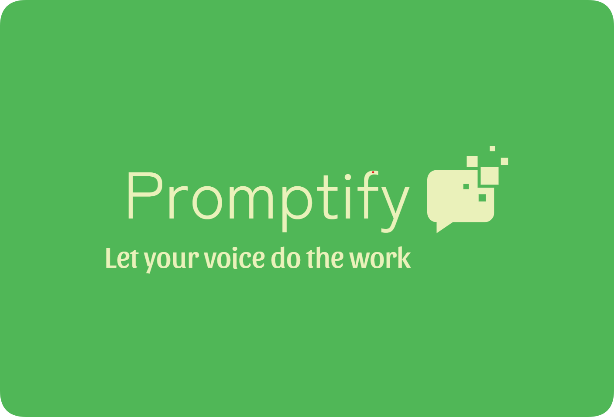

Promptify - HACKABULL-23
====================



Letting your voice do the work
---------------------
Streamline your life and stay ahead of the curve with Promptify - the voice assistant that can handle complex questions with ease.

### Inspiration
Have you ever been trying to use Siri and it just cannot do what you want it to do? What about Google home or Alexa?
We all found this to be a severe weakness in existing technology. Promptify is the next step towards creating next
generation voice assistants that can answer arbitrary prompts, not limited by the engineer's imagination, but by yours. 

### What it does
Promptify is a voice assistant application that allows for complex queries. A simple query might consist of asking it
to skip two songs while you're listening to Spotify. Promptify has no issues with this, and while it might seem simple
on the surface, even this simple prompt posses challenges for good voice assistants.
However, you can also ask it complex queries. Things like create a playlist of 10 Taylor Swift songs called my Taylor Swift mix.
Using the Spotify API, this takes 5 function calls and some Python array magic. Promptify handles this with ease, begging the
question of what can't this application do?

### How we built it
The backbone of the project runs off GPT3 from the openAI API. On top of this backbone sit google cloud's voice to speech and speech to text APIs.
Branching off of this several APIs have been tacked on to add functionality to Promptify.
The premiere API in this category is Spotipy, Spotify's Python API. Other APIs were added later and the ability to add more is incredibly easy.
To showcase this entire project, Kivy was used to produce a clean user experience consistent with modern GUI standards.

### Challenges we ran into
About a quarter way through the project, we realized that GPT3 was far more powerful than we had originally assumed.
This made some portion of our work obsolete as we graduated towards using it for more. Accidentally, this also resulted in
the prompts costing less, because less context was needed. Additionally, Kivy proved to be difficult. We needed a development
branch to fix several issues, but this branch had its own share of bugs!

### Accomplishments that we're proud of
It was an amazing moment when we finally get everything working together.
Until that moment you're constantly wondering if the project will be able to be finished,
but looking at that final product is immensely rewarding.

### What we learned
I think the biggest lesson we learned is that chatGPT3 is only getting better and as the release new versions
it will only get more powerful (GPT4 is crazy!). Once people realize what these tools can do, it's truly going to 
revolutionize how people think about the world and what is and isn't possible for them to do.

### What's next for Promptify
Do to the way that we developed Promptify, it is incredibly easy to tack on more APIs and API function headers to the
context we provide our voice assistant. As a result, we could add arbitrarily many of these APIs to the AI to allow for
more and more complex tasks. The future is bright! Lots of area's to move forward in.


Installation instructions
---------------------

Refer to the KivyMD page for installing the ui components https://github.com/kivymd/KivyMD
You will have to run these pip install commands for the app to work.
For all other installations, install based on the error messages on import.
```bash
pip install https://github.com/kivy/kivy/archive/master.zip
pip install https://github.com/kivymd/KivyMD/archive/master.zip
```

Additionally, you will have to set up a file called 
```bash
API_KEY.py 
```
That contains the variable
```bash
api_key = "XXXXXXXXXXXXXXXXXX"
```
You will have to fill this in with your own api_key from the openAI website.
Similar authentication tokens ae expected for each additional API that was used.

